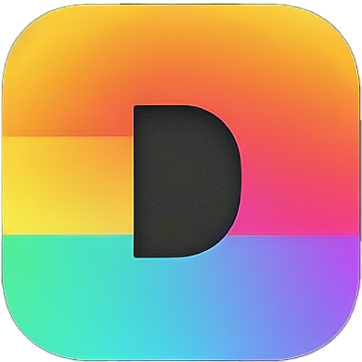
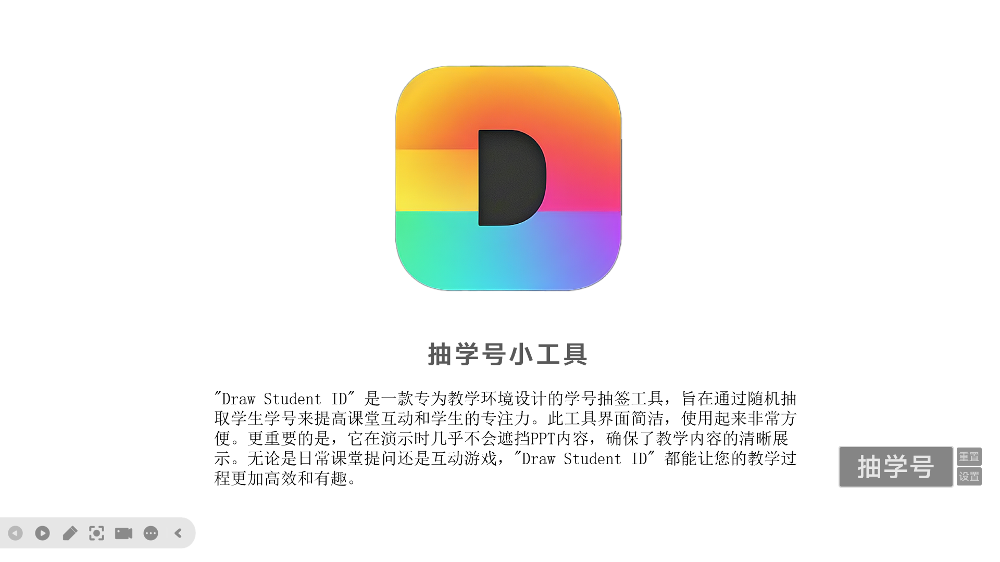
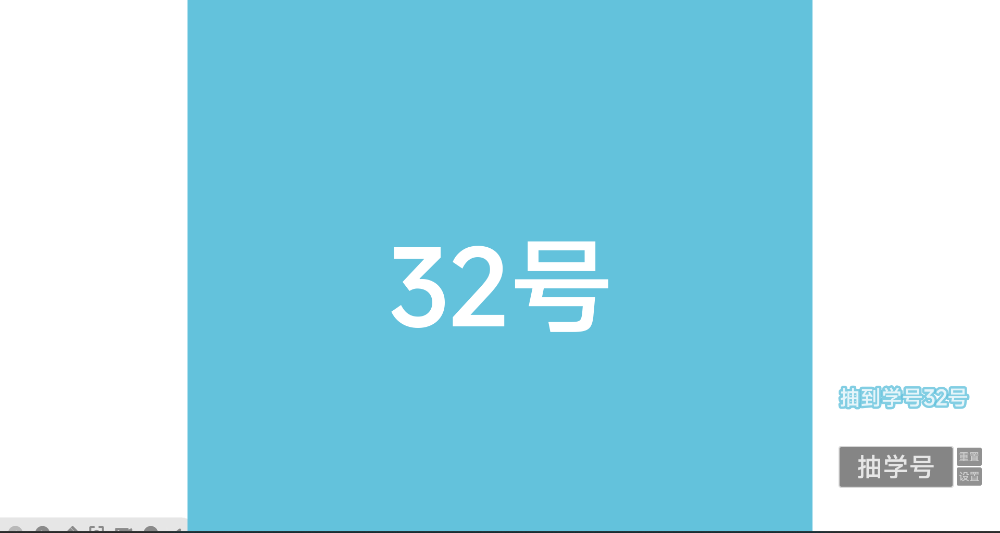
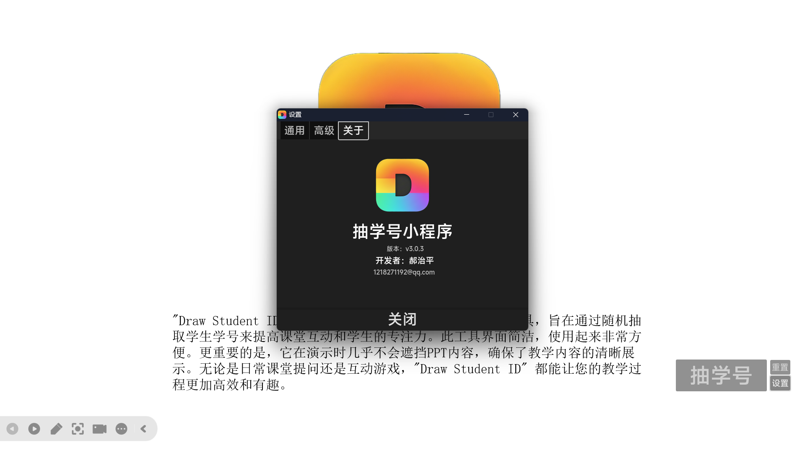

<h1>Draw Student ID   一个用godot制作的抽学号小程序</h1>

  

## 这是什么？

**抽学号小程序 (Draw Student ID)** 是一款专为教学环境设计的学号抽签工具，旨在通过随机抽取学生学号来提高课堂互动和学生的专注力。此工具界面简洁，使用起来非常方便。更重要的是，它在演示时几乎不会遮挡PPT内容，确保了教学内容的清晰展示。无论是日常课堂提问还是互动游戏，抽学号小程序都能让您的教学过程更加高效和有趣。

## 屏幕截图

